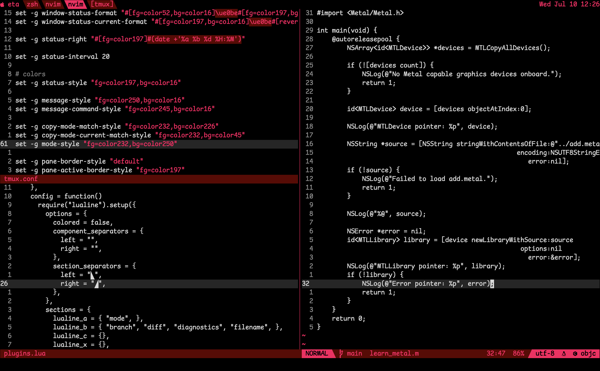

# vampire.nvim
An overhaul of [decoldest.vim](https://github.com/mxi/decoldest.vim) via rewrite in lua and
addition of tasteful accents. This is tuned to my personal setup, so some highlight groups
are not styled, but the source is straightforward and easy to modify.

# tmux
To aid in writing absolutely disgusting tmux configs, strings, format strings, and escapes
are specifically highlighted to hopefully make the job less painful than it already is.
